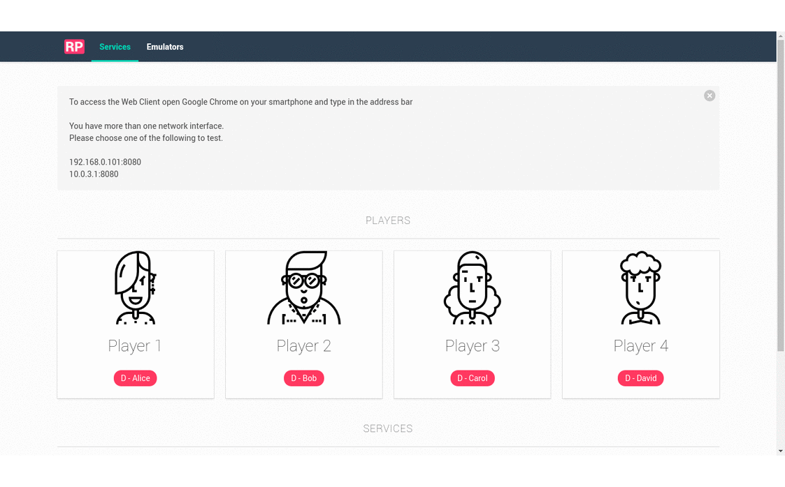

# Remote Pad GUI

Electron app to lauch emulators on your desktop and allows you to connect
your smartphone to use as a remote controller.

It manages both [Remote Pad](https://github.com/comsolid/remote-pad)
and [Remote Pad Server](https://github.com/comsolid/remote-pad-server).
These two services are responsible for integrate your smartphone and
your desktop to send keyboard strokes to control your favorite games.



## Getting Started

To install the app go to [Releases Page](https://github.com/comsolid/remote-pad-gui/releases)
and download the app for your system.

> Remote Pad GUI only works in 64 bit systems, because it relies on
> [robotjs](http://robotjs.io/).

The `AppImage` version runs on Linux without installation. Just double click it.

The `deb` version is for Debian/Ubuntu based systems. You can install through
`GDebi` or `dpkg`.

```bash
sudo dpkg -i remote-pad-gui_x.x.x_amd64.deb
```

Replace `x` for the version.

Find out more in the [Documentation](https://comsolid.github.io/remote-pad-gui/)

## Build Setup

```bash
# install dependencies on debian/ubuntu/mint
sudo apt-get install icnsutils
sudo apt-get install graphicsmagick
```

``` bash
# install dependencies
yarn install

# serve with hot reload at localhost:9080
npm run dev

# build electron app for production
npm run build

# lint all JS/Vue component files in `app/src`
npm run lint

# run webpack in production
npm run pack
```

Find out more about [Development](https://comsolid.github.io/remote-pad-gui/development.html).

---

This project was generated from [electron-vue](https://github.com/SimulatedGREG/electron-vue) using [vue-cli](https://github.com/vuejs/vue-cli). Documentation about this project can be found [here](https://simulatedgreg.gitbooks.io/electron-vue/content/index.html).
