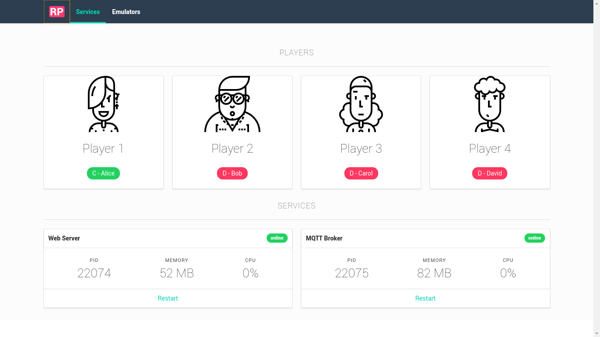

# Remote Pad GUI

Electron app to manage both
[Remote Pad](https://github.com/comsolid/remote-pad/)
and [Remote Pad Server](https://github.com/comsolid/remote-pad-server).

## Screen shots

The app wraps two services, Remote Pad Web and Remote Pad Server,
and starts them for you.

After connected you can configure an emulator, for example Mupen64Plus
and start the game within the app.
