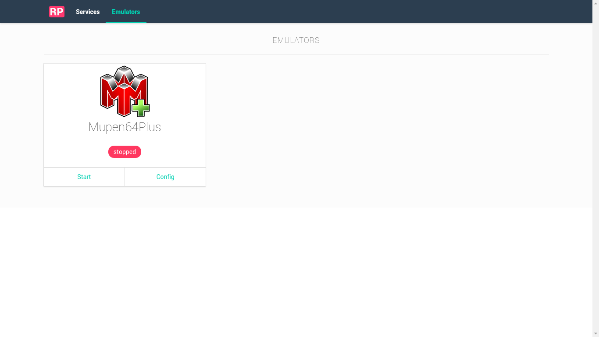

# Emulators

Remote Pad GUI has support for the following emulators:

Emulator | License
--- | ---
[Mupen64plus](https://github.com/mupen64plus/mupen64plus-core) | GPLv2
[Snes9x](https://github.com/snes9xgit/snes9x) | LGPLv2
[ePSXe](http://www.epsxe.com/) | freeware

## Screenshot

