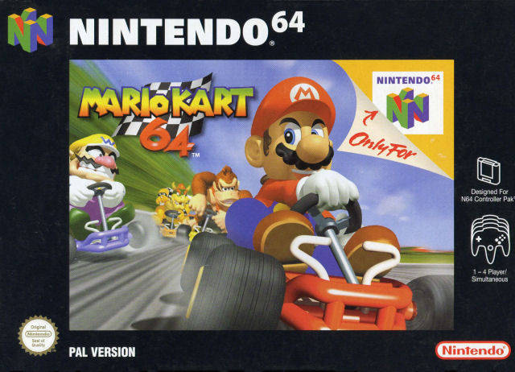
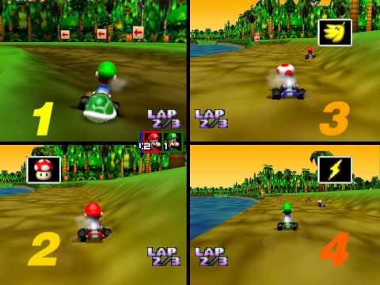
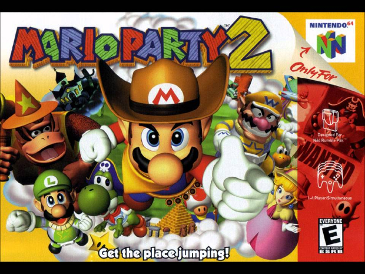
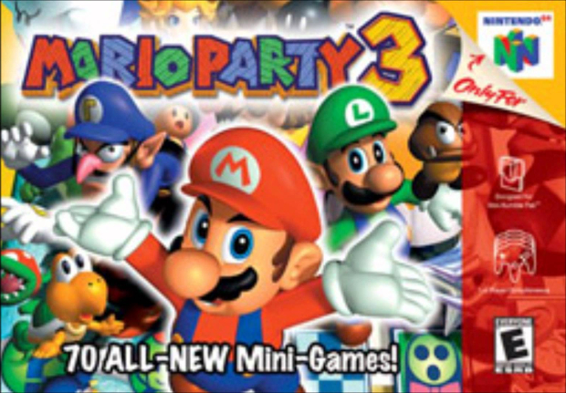
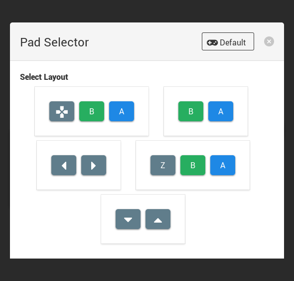
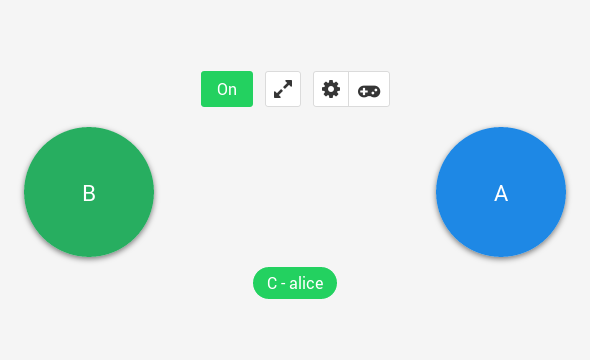
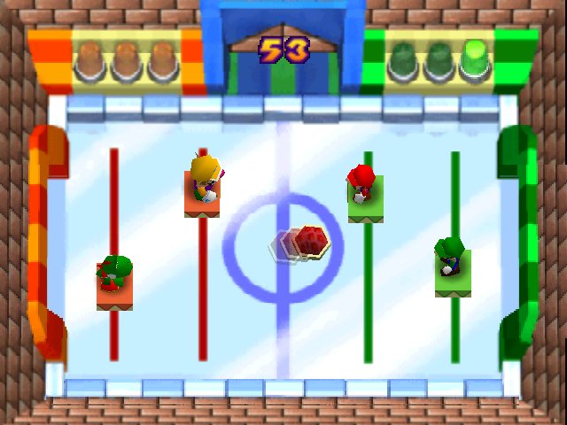
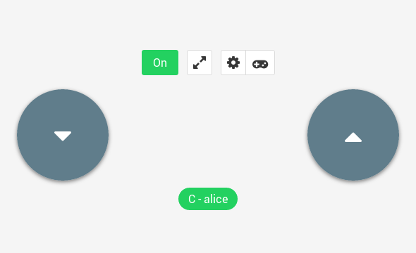
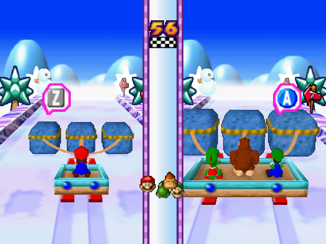
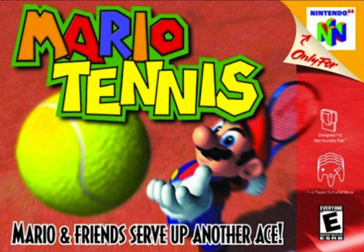

# Supported Games

In theory any game should be supported, but some games may
be difficult to play than others.

Here's a list of good and fun games to play on Remote Pad.

## Race Games

### Mario Kart 64

### Up to 4 players

## Directional

### Mario Party 1, 2 and 3

### Adaptative Layout

For games like "Shy Guy Says" in Mario Party 1

You can change the layout to:

For games like "Speed Hockey" in Mario Party 2

You can change the layout to:

For games like "Thwomp Pull" in Mario Party 3

You can change the layout to:

### Mario Tennis

