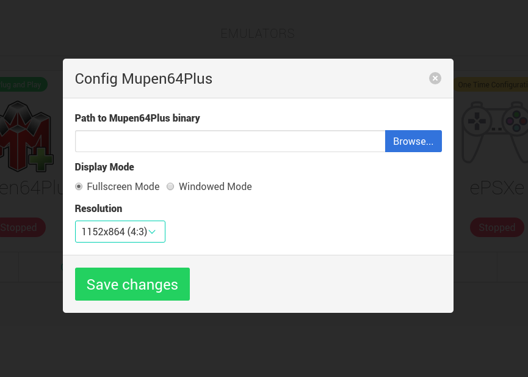
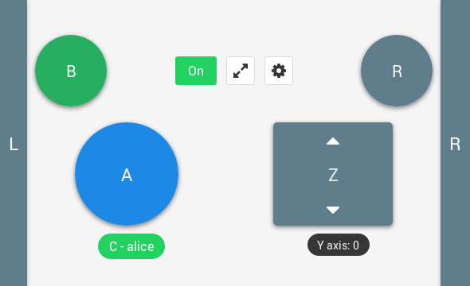

# Mupen64plus

> Mupen64Plus is a cross-platform plugin-based N64 emulator which is capable of
> accurately playing many games. Included are four MIPS R4300 CPU emulators,
> with dynamic recompilers for 32-bit x86 and 64-bit amd64 systems, and necessary
> plugins for audio, graphical rendering (RDP), signal co-processor (RSP), and
> input. There is 1 included OpenGL video plugin, called RiceVideo. There are 3
> other excellent video plugins being maintained by wahrhaft, called Arachnoid,
> Glide64, and Z64.

## Features

* Dynamic recompilers for Intel (x86 and amd64) and ARM CPUs
* Two OpenGL video plugins, with Hi-resolution texture support
* LIRC Infrared remote control support
* Rumble Pak support
* Cheat system with gameshark code support
* Speed adjustment with smooth sound output
* Shared library interface for integration into other systems (front-ends)
* Command-line Front-end application

## Settings

## Keyboard mapping

Button | 1 - Alice | 2 - Bob | 3 - Carol | 4 - David
:---:|:---:|:---:|:---:|:---:
left | left | a | j | v
right | right | d | l | n
up | up | w | i | h
down | down | s | k | b
A | shift | e | y | c
Z | z | x | u | , (comma)
B | control | q | o | . (dot)
R | space | r | t | home

## Emulator shortcuts

The keys or joystick/mouse inputs which will be mapped to the N64 controller
for playing the games are determined by the input plugin.  The emulator core
also supports several key commands during emulation. They are:

- **Escape (Esc)** Quit the emulator
- **0-9** Select virtual 'slot' for save/load state (F5 and F7) commands
- **F5** Save emulator state
- **F7** Load emulator state
- **F9** Reset emulator
- **F10** Slow down emulator by 5%
- **F11** Speed up emulator by 5%
- **F12** Take screenshot
- **Alt-Enter** Toggle between windowed and fullscreen (may not be supported by all video plugins)
- **p or P** Pause on/off
- **m or M** Mute/unmute sound
- **g or G** Press "Game Shark" button (only if cheats are enabled)
- **/ or ?** Single frame advance while paused
- **f or F** Fast Forward (playback at 250% normal speed while F key is pressed)
- **[** Decrease volume
- **]** Increase volume

## Layouts

### Directional

### Race

