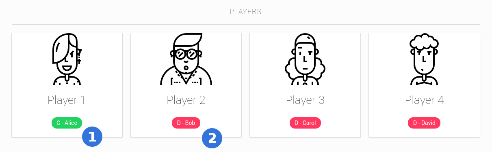
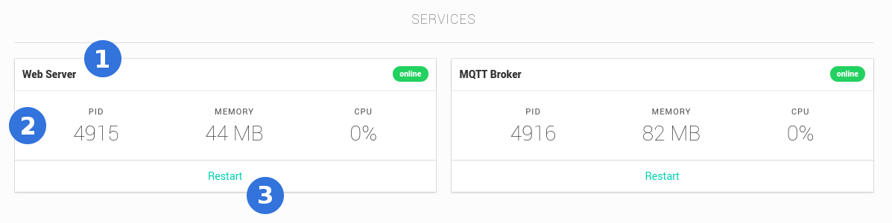

# Services

The services are divided in Players and the Services itself.

## Players

Remote Pad supports up to 4 players. Each player has indication of connection as
you can see in **(1)**. In this case **(1)** is indicating that **Alice** is
Connected **C**. And **Bob**, indicated by **(2)**, is Disconnected **D**.

## Services

The Remote Pad GUI when started runs 2 Services, Web Server and MQTT Broker.
For each service you have a name and a status connection as seen in **(1)**,
some information about the process **(2)** and a **Restart** button **(3)**.
