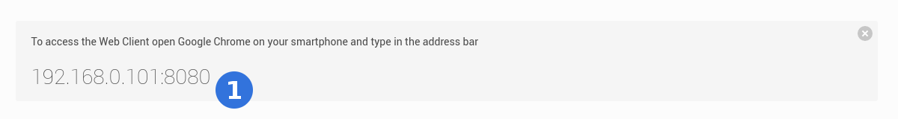
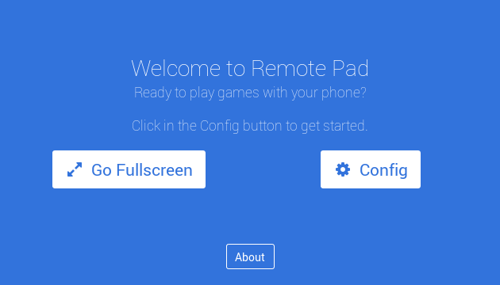
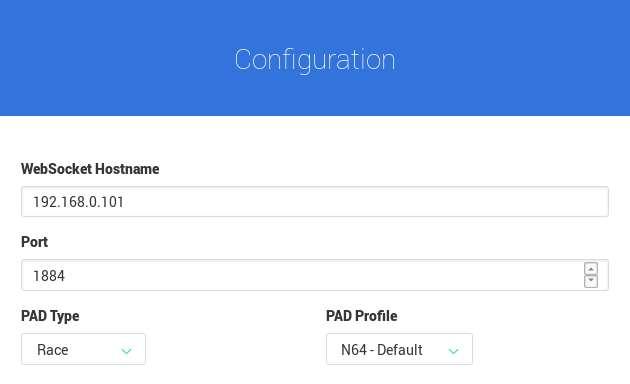
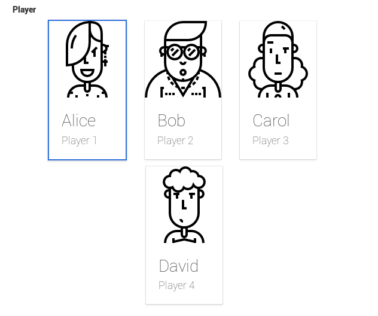
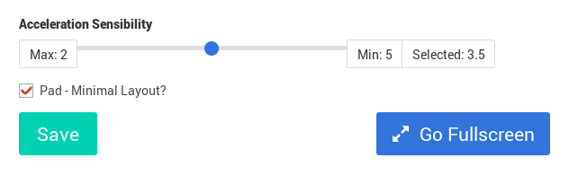
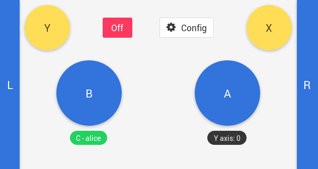
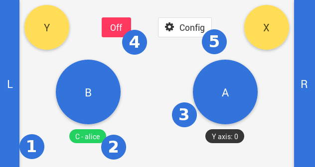

# Web Server

Is the main interface between the app and you. Is responsible for the
web page where you, the user, will interact. To access you need to
open Chrome 55+ for Android or iOS and enter the IP Address and Port
indicated by Remote Pad GUI.

For example:

**(1)** is indicating that you should open the Chrome 55+ and type
in the address bar **192.168.0.101:8080**. This address could be different,
it depends on your network configuration.

After load you should see this page:

**Go Fullscreen** button only works in Android.

## Config Screen

Click on the **Config** button to open the Config Screen.

This screen comes with preconfigured values.

Scroll down to choose your player.

Hit **Save** button.

## Race Pad

If you choose **PAD Type** **Race** you will see the following screen.

Above an image explaing all funcionality.

**(1)** is the Left **L** indication. This is not a button but an indication
that turns red when you incline your phone. Same for Right **R** on the other
side.

**(2)** is the Connection status as well your Player. It shows **C** for Connected
and **D** for Disconnected.

**(3)** the **A** button. For the Race Pad you have 4 action buttons:
**A, B, Y** and **X**. Usually you will just need **B** for acceleration and
**A** for special items.

**(4)** the **On/Off** button. When is **Off** it stops send commands.

**(5)** the **Config** button. You may return to configuration for different
setup.
